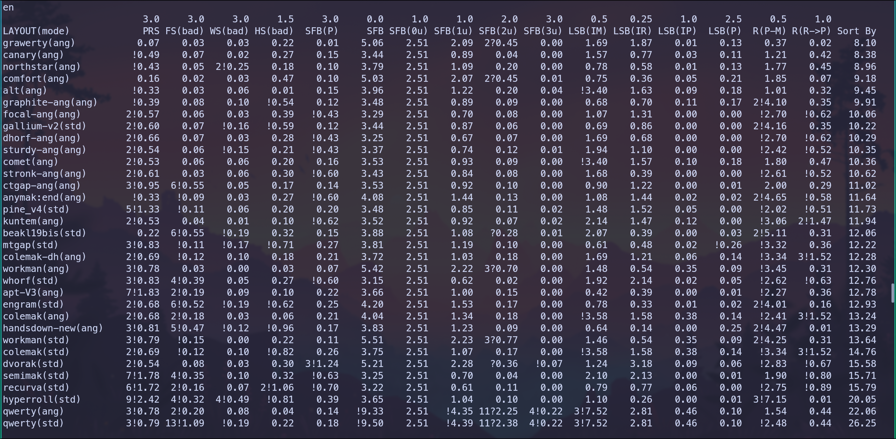
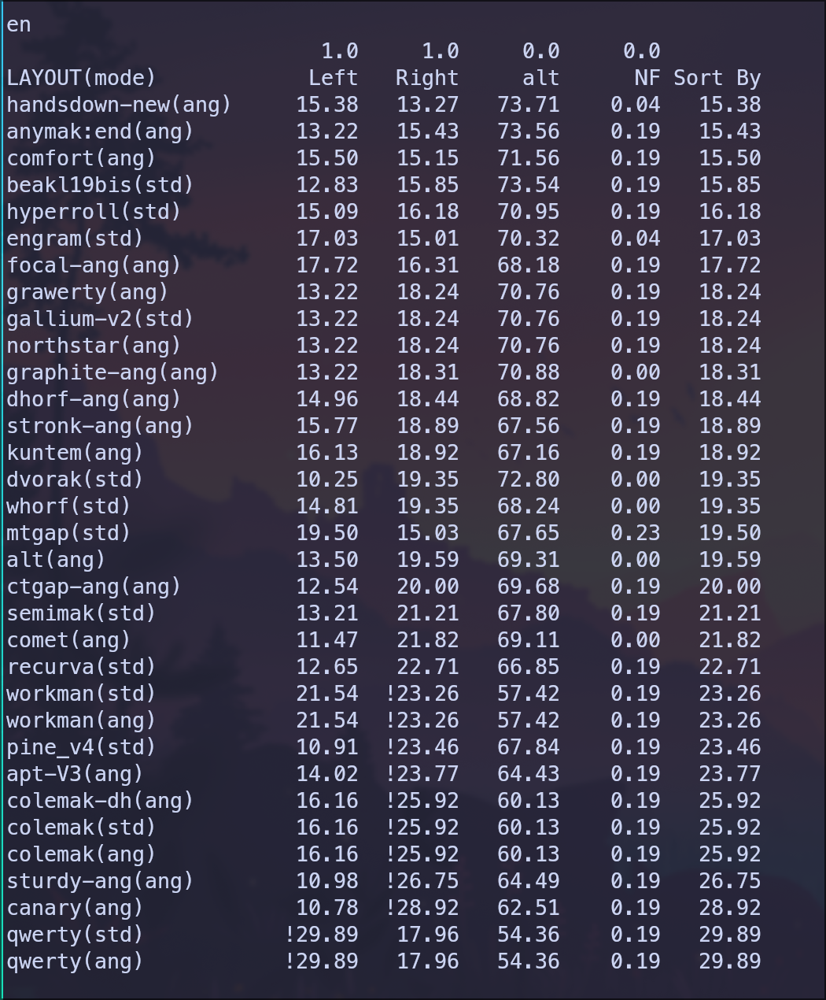
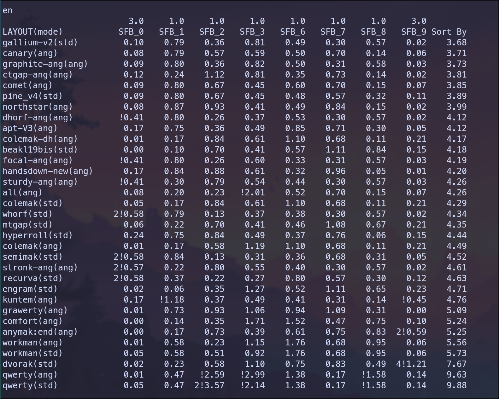

# ABA – All Bigrams Analyzer

## Why another analyzer?

If you look at the results of a keyboard layout bigram analysis in any analyzer and add them together, the sum won't exceed 5%. Where are the results for the other bigrams? Are they really that unimportant?
  
These analyzers also do not take into account a person's individual preferences for typing certain key combinations on one hand.
As a result, I found it difficult to evaluate the usability of any particular layout for myself. I should note that evaluating a layout based solely on bigram analysis is impossible, and my bigram analyzer doesn't claim to be a full-fledged layout analyzer—it's simply an additional utility that fills the gaps in modern analyzers.

## Possible algorithm for applying ABA

When choosing a layout, I proceed as follows: first, I select layouts that meet my requirements for redirects (especially bad ones); at this stage, significant selection occurs. I don't pay attention to the number of rolls, as these can be scissors or other awkward combinations. I simply look at the ratio of inward/outward rolls. There shouldn't be significantly more outward rolls than inward rolls.

I run the remaining layouts through my analyzer, which creates a comparison table. Since comfort is important to me, I choose the layouts with the fewest awkward combinations. If there are several such layouts, I look at the comfortable combinations and choose the one with the most.

## What's new in version 2.0

### 1. Added classification of bigrams by their type (PRS, SFB, LSB, etc.).
Here's a comparison table of layouts by bigram type:

- **PRS** – Pinky/Ring Scissors (Half and Full)
- **FS(bad)** – Full Scissors (only Bad). Good Scissors (Index on buttom row) not included
- **WS(bad)** – Wide Scissors (only Bad)
- **HS(bad)** – Half-Scissors (only Bad). For example `wd`, `dw`, `sc` on Qwerty
- **SFB(P)** – SFB on Pinkies
- **SFB** – All SFB (SFB(0u) included))
- **SFB(3u)** – For example `br`, `my` on Qwerty
- **LSB(IM)** – LSB on Index/Middle. Qwerty `nk` – not LSB on ANSI keyboard. Qwerty `ve` – LSB on Standart and Angle Mode
- **LSB(IR)** – LSB on Index/ Ring. Qwerty `nl` – not LSB on ANSI keyboard. Qwerty `vw` – LSB on Standart and Angle Mode
- **LSB(IP)** – LSBs that require simultaneous stretching of the little finger and index finger. For example `ba`, `ab` on Qwerty
- **LSB(P)** - LSB Pinky/Ring + LSB Pinky/Middle
- **R(P-M)** – Rolls Pinky/Middle
- **R(R→P)** – Roll-out Ring→Pinky
- **Sort By** = sum(k*value)

If a value exceeds a certain **threshold**, a `!` appears next to the value. The `number before` the `!` indicates how many times the threshold is exceeded.

### 2. A table has been added for comparing layouts based on the number of bigrams on one hand.

### 3. Added breakdown of SFB (SFB(0u) included) by fingers

### 4. The full layout report now looks like this:

https://github.com/mohoaz1348-rgb/layout_bigrams_analyzer/blob/main/ANSI/en/results_all/qwerty(std)

### 5. New layouts added
### 6. Now the layout needs to be specified in the following format:
 
https://github.com/mohoaz1348-rgb/layout_bigrams_analyzer/blob/main/ANSI/en/layouts/grawerty

## How ABA Works

Now I'll explain how all the bigrams of a language are analyzed for the layout. I use a standard keyboard for typing, so I'll use that as an example. The left and right hand keys are numbered sequentially. Then, for each key combination on one hand, I build a preference matrix (they are different for standard mode and Angle Mod)

See [efforts_readme](./ANSI/efforts_readme)

- `-3` – the most inconvenient combinations
- `0` – neutral combinations
- `3` – the most convenient combinations

This is the most labor-intensive part, which can take a full day. But at least you'll know for sure that the analysis results reflect your preferences.

Then, based on these effort matrices, all the bigrams in the language are classified, the total frequency is calculated for each category (`-3`, `-2`, `-1`, `0`, `1`, `2`, `3`), and a final comparison table is created. The results are sorted by the `-3` column, as I believe that the comfort of a layout is primarily determined by the absence of awkward combinations.

See [results](./ANSI/en/results)  
Full results for each layout are available [here](./ANSI/en/results_all).

The mode in which the layout was analyzed is indicated in parentheses after the layout name. Values ​​are given as percentages.

## Some of my least favorite combinations

- Full scissors - `-3` – except for combinations where the index finger is down and the middle finger is up
- Half scissors (pinky, ring) - `-3`
- sfb(0u)(pinky) - `-3`
- sfb(0u)(index, middle, ring) - `-1`
- sfb(1u)(pinky) - `-3`
- sfb(1u)(index, middle, ring) - `-1`
- sfb(2u)(pinky) - `-3`
- sfb(2u)(index, middle, ring) - `-2`
- **rolls(pinky, middle) - `-1`, `-2`**
- lsb - `0`, `-1`

I don't demonize SFB (except for pinkies) and I don't think they are the most awkward combinations.

## Using ABA

After cloning the repository, simply navigate to the folder containing the `analyze.py` file and run it (no additional dependencies or virtual environments required):
`python analyze.py`

All layouts for each language will be analyzed. Comparison tables for each language will appear in the terminal and will be saved to the file `lang/results` (where `lang` is the language name). Detailed results for each layout will not be output to the terminal, but will be saved to a 
file in the `lang/results_all` folder. The threshold for displaying a bigram in the full report is set to 0.005% and can be easily changed in the script file.

If a particular layout isn't included in the analysis, simply copy the existing layout file and edit it. Don't forget to specify the analysis mode `std` or `ang` in the layout file. Both modes can be specified (separated by a space).

The analyzer only includes English and Russian layouts, but you can add any language for analysis by creating a folder with the name of the language and adding the layout files to it. Then add the language to the list of languages​ in the `analyze.py` script. You will also need to create a file with the list of bigrams and their frequencies.

The analyzer only supports the ANSI keyboard, but it can be used with any keyboard with any number of keys. Simply create a new keyboard folder, number the keys sequentially for each hand, and, based on this numbering, construct matrices of efforts and add them to the corresponding files (`left`, `right`), from where the analyzer reads them. The folder structure should be the same as for `ANSI` folder. Next, copy `analyze.py` to the keyboard folder and run it.
